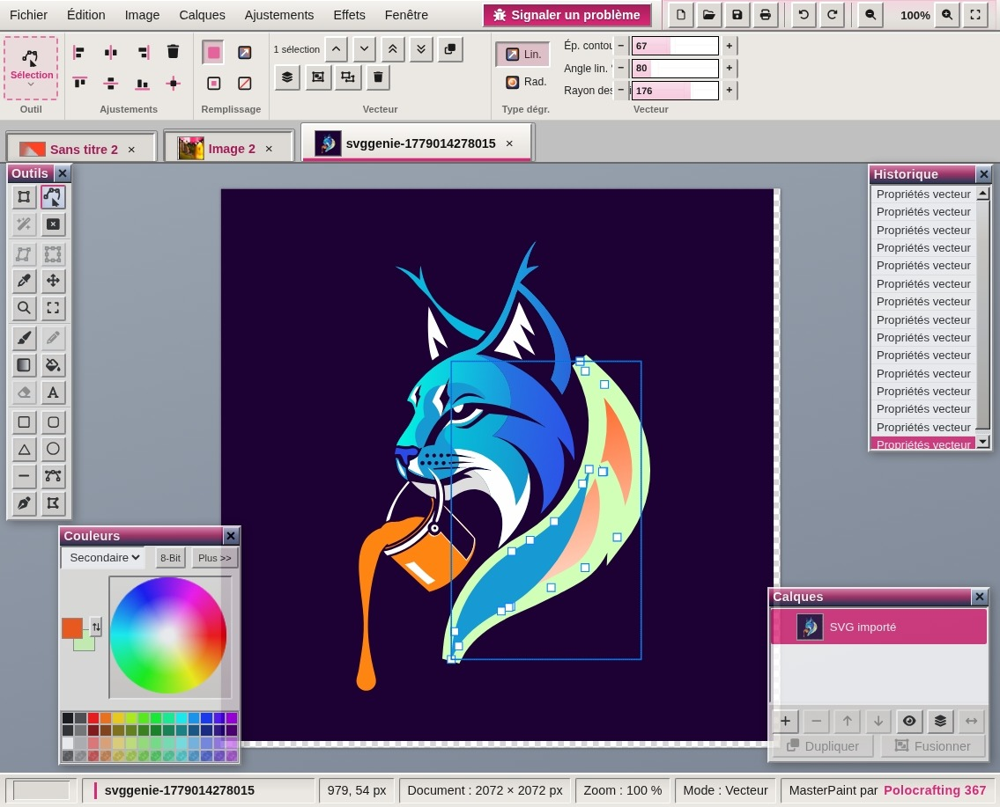
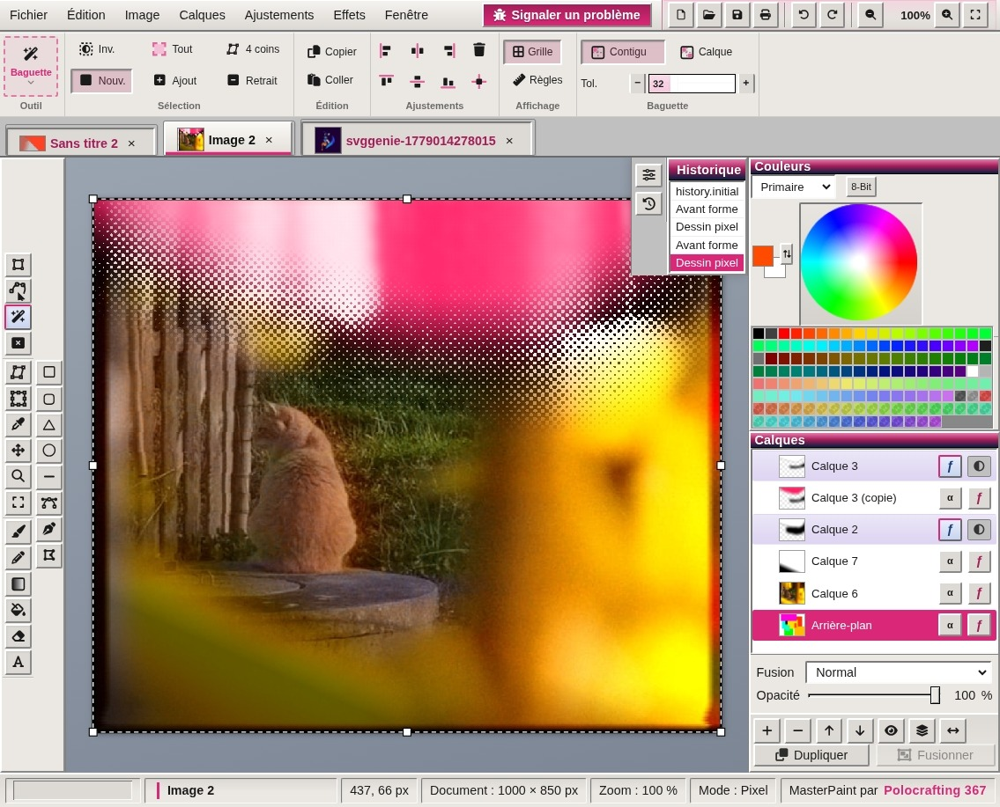
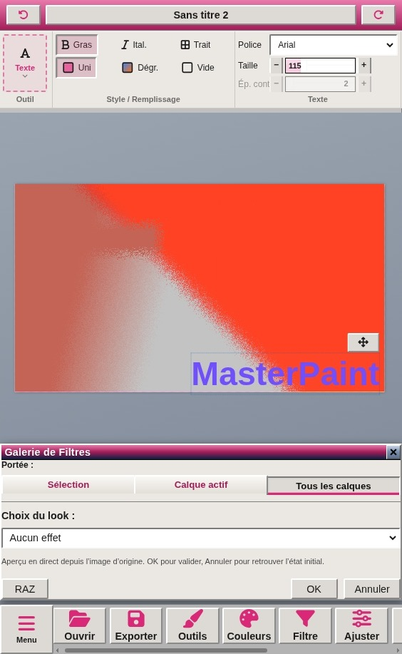

<!-- MasterPaint README — présentation style Windows 98 -->

<table cellpadding="0" cellspacing="0" border="0" style="max-width:720px;margin:0 auto;font-family:'Tahoma','MS Sans Serif',Arial,sans-serif;font-size:13px;">
<tr><td>

<!-- Barre titre principale -->
<table width="100%" cellpadding="0" cellspacing="0" border="0" style="border:2px solid #000;border-bottom:none;background:#000080;">
<tr>
<td style="padding:3px 6px;color:#fff;font-weight:bold;font-size:14px;letter-spacing:0.02em;">

MasterPaint 98 — Lisez-moi
</td>
<td align="right" style="padding:2px 4px;">
_
□
×
</td>
</tr>
</table>

<!-- Corps fenêtre -->
<table width="100%" cellpadding="0" cellspacing="0" border="0" style="border:2px solid #000;background:#c0c0c0;">
<tr><td style="padding:10px 12px 12px;">

<table width="100%" cellpadding="0" cellspacing="0" border="0">
<tr><td align="center" style="padding-bottom:10px;">
<a href="http://polocrafting.fr/Illu" style="display:inline-block;padding:4px 14px;background:#c0c0c0;color:#000;text-decoration:none;font-weight:bold;border:2px solid;border-color:#fff #404040 #404040 #fff;">▶ Démo en ligne</a>
&nbsp;
Open Source
100 % local
Thème Win98 Modern
</td></tr>
</table>

<!-- Groupe : À propos -->
<table width="100%" cellpadding="0" cellspacing="0" border="0" style="margin-bottom:10px;">
<tr><td style="background:#000080;color:#fff;font-weight:bold;padding:2px 6px;font-size:12px;">À propos</td></tr>
<tr><td style="border:2px solid;border-color:#404040 #fff #fff #404040;padding:8px 10px;background:#fff;color:#000;line-height:1.45;">

<strong>MasterPaint</strong> s’inspire de <strong>Paint.NET</strong>, <strong>Photoshop</strong> et <strong>Illustrator</strong>.
Créez des images <em>bitmap</em> et <em>vectorielles</em> au même endroit, sans publicité ni traceurs.
Tout fonctionne à <strong>100 % en local</strong> : le navigateur peut utiliser <code>localStorage</code> et IndexedDB pour une sauvegarde temporaire sur votre machine.

</td></tr>
</table>

<!-- Groupe : Dispositions -->
<table width="100%" cellpadding="0" cellspacing="0" border="0" style="margin-bottom:10px;">
<tr><td style="background:#000080;color:#fff;font-weight:bold;padding:2px 6px;font-size:12px;">Dispositions de l’interface</td></tr>
<tr><td style="border:2px solid;border-color:#404040 #fff #fff #404040;padding:8px 10px;background:#c0c0c0;color:#000;line-height:1.45;">

Choisissez la mise en page dans <strong>Paramètres → Disposition de l’interface</strong>.
Trois modes bureau / mobile sont disponibles&nbsp;:

<table width="100%" cellpadding="6" cellspacing="0" border="0">
<tr valign="top">

<td width="33%" style="padding:4px;">
<table width="100%" cellpadding="0" cellspacing="0" border="0">
<tr><td style="background:#000080;color:#fff;font-weight:bold;padding:2px 5px;font-size:11px;">Paint.NET</td></tr>
<tr><td style="border:2px solid;border-color:#fff #404040 #404040 #fff;padding:6px;background:#fff;text-align:center;">
 
<small style="color:#000;">Fenêtres volantes repositionnables (outils, couleurs, calques, historique).</small>
</td></tr>
</table>
</td>

<td width="33%" style="padding:4px;">
<table width="100%" cellpadding="0" cellspacing="0" border="0">
<tr><td style="background:#000080;color:#fff;font-weight:bold;padding:2px 5px;font-size:11px;">Photoshop</td></tr>
<tr><td style="border:2px solid;border-color:#fff #404040 #404040 #fff;padding:6px;background:#fff;text-align:center;">
 
<small style="color:#000;">Colonnes ancrées&nbsp;: outils à gauche, couleurs et calques à droite, rail curseurs / historique.</small>
</td></tr>
</table>
</td>

<td width="33%" style="padding:4px;">
<table width="100%" cellpadding="0" cellspacing="0" border="0">
<tr><td style="background:#000080;color:#fff;font-weight:bold;padding:2px 5px;font-size:11px;">Téléphone</td></tr>
<tr><td style="border:2px solid;border-color:#fff #404040 #404040 #fff;padding:6px;background:#fff;text-align:center;">
 
<small style="color:#000;">Menu ☰, barre d’outils compacte, palettes en colonnes / dock bas (idéal petit écran).</small>
</td></tr>
</table>
</td>

</tr>
</table>

<strong>Note :</strong> le passage entre mode <em>téléphone</em> et modes <em>bureau</em> (Paint.NET / Photoshop) recharge la page pour réinitialiser l’interface.

</td></tr>
</table>

<!-- Groupe : Fonctionnalités -->
<table width="100%" cellpadding="0" cellspacing="0" border="0" style="margin-bottom:10px;">
<tr><td style="background:#000080;color:#fff;font-weight:bold;padding:2px 6px;font-size:12px;">Fonctionnalités</td></tr>
<tr><td style="border:2px solid;border-color:#404040 #fff #fff #404040;padding:0;background:#fff;">
<table width="100%" cellpadding="0" cellspacing="0" border="0" style="font-size:12px;">
<tr style="background:#000080;color:#fff;">
<th align="left" style="padding:4px 8px;border-right:1px solid #404040;">Domaine</th>
<th align="left" style="padding:4px 8px;">Description</th>
</tr>
<tr style="background:#fff;"><td style="padding:5px 8px;border-top:1px solid #c0c0c0;border-right:1px solid #c0c0c0;font-weight:bold;">Formes &amp; calques</td><td style="padding:5px 8px;border-top:1px solid #c0c0c0;">Bitmap et vectoriel, calques et formes modifiables</td></tr>
<tr style="background:#f0f0f0;"><td style="padding:5px 8px;border-top:1px solid #c0c0c0;border-right:1px solid #c0c0c0;font-weight:bold;">Dessin</td><td style="padding:5px 8px;border-top:1px solid #c0c0c0;">Pinceau, crayon, gomme, pot de peinture, dégradé</td></tr>
<tr style="background:#fff;"><td style="padding:5px 8px;border-top:1px solid #c0c0c0;border-right:1px solid #c0c0c0;font-weight:bold;">Effets</td><td style="padding:5px 8px;border-top:1px solid #c0c0c0;">Filtres, effets dynamiques sur calques, accélération WebGL / WebAssembly</td></tr>
<tr style="background:#f0f0f0;"><td style="padding:5px 8px;border-top:1px solid #c0c0c0;border-right:1px solid #c0c0c0;font-weight:bold;">Outils</td><td style="padding:5px 8px;border-top:1px solid #c0c0c0;">Déformation, perspective, sélection et alignement</td></tr>
<tr style="background:#fff;"><td style="padding:5px 8px;border-top:1px solid #c0c0c0;border-right:1px solid #c0c0c0;font-weight:bold;">Interface</td><td style="padding:5px 8px;border-top:1px solid #c0c0c0;">Paint.NET, Photoshop ou téléphone (voir captures ci-dessus)</td></tr>
</table>
</td></tr>
</table>

<!-- Groupe : Démarrage -->
<table width="100%" cellpadding="0" cellspacing="0" border="0" style="margin-bottom:6px;">
<tr><td style="background:#000080;color:#fff;font-weight:bold;padding:2px 6px;font-size:12px;">Démarrage</td></tr>
<tr><td style="border:2px solid;border-color:#404040 #fff #fff #404040;padding:8px 10px;background:#fff;color:#000;">

<strong>En ligne</strong> — <a href="http://polocrafting.fr/Illu">polocrafting.fr/Illu</a>

<strong>En local</strong> — Téléchargez le ZIP du projet, lancez XAMPP (ou tout serveur web local) et ouvrez l’application dans le navigateur.

</td></tr>
</table>

</td></tr>
</table>

<!-- Barre d'état -->
<table width="100%" cellpadding="0" cellspacing="0" border="0" style="border:2px solid #000;border-top:1px solid #404040;background:#c0c0c0;">
<tr>
<td style="padding:2px 6px;font-size:11px;color:#000;border:1px solid;border-color:#404040 #fff #fff #404040;width:70%;">
Prêt — Application développée par <a href="https://polocrafting.fr" style="color:#000080;">polocrafting</a>
</td>
<td align="right" style="padding:2px 6px;font-size:11px;color:#000;">
NUM ▼ CAPS
</td>
</tr>
</table>

</td></tr>
</table>

<!-- Fallback Markdown (lecteurs sans HTML) -->

## MasterPaint 98

Éditeur bitmap / vectoriel local, thème Windows 98 Modern.

- **Démo :** [polocrafting.fr/Illu](http://polocrafting.fr/Illu)
- **Dispositions :** Paint.NET (`IMG/Paint.jpeg`), Photoshop (`IMG/Photo.jpeg`), Téléphone (`IMG/Phone.jpeg`)
- **Développeur :** [polocrafting](https://polocrafting.fr)
