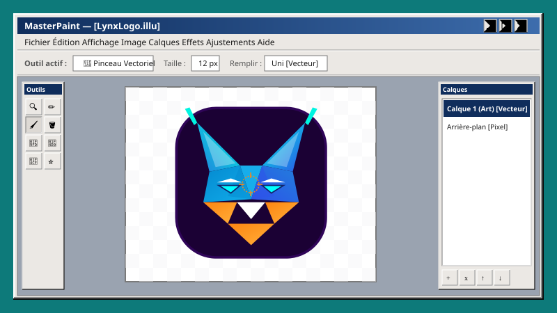

  

<table width="100%" cellpadding="0" cellspacing="0" style="border-collapse:collapse;font-family:'Segoe UI',Tahoma,Arial,sans-serif;font-size:13px;color:#1a1a1a;">
  <tr>
    <td style="background:#0d7a7a;padding:12px 12px 0;">
      <table width="100%" cellpadding="0" cellspacing="0" style="border-collapse:collapse;border:2px solid #0a0a0a;">
        <tr>
          <td style="background:linear-gradient(90deg,#0f2d5c 0%,#3d6dad 100%);color:#fff;padding:3px 6px;font-size:12px;font-weight:700;">
            
            MasterPaint 98 Pro
          </td>
        </tr>
        <tr>
          <td style="background:#ebe8e4;border:2px solid;border-color:#fff #0a0a0a #0a0a0a #fff;padding:10px 12px;">
            

              Inspiré de Paint.NET, Photoshop et Illustrator. Créez des images bitmap et vectorielles au même endroit, sans publicité ni traceurs. Tout fonctionne à 100&nbsp;% en local, sans envoi de données&nbsp;: le navigateur utilise localStorage pour un stockage temporaire sur votre machine.
            

            

              Les données du projet sont enregistrées dans le stockage local du navigateur&nbsp;; tout le traitement d’image se fait 100&nbsp;% en local, sans envoi serveur.
            

            

              Open Source
              100&nbsp;% local
              Win98 Modern
            

            

              <a href="http://polocrafting.fr/Illu" style="display:inline-block;background:#c0c0c0;color:#1a1a1a;text-decoration:none;font-weight:600;font-size:12px;padding:4px 14px;border:2px solid;border-color:#fff #0a0a0a #0a0a0a #fff;">Essayer en ligne</a>
            

          </td>
        </tr>
      </table>
    </td>
  </tr>
</table>

 

<table width="100%" cellpadding="0" cellspacing="0" style="border-collapse:collapse;font-family:'Segoe UI',Tahoma,Arial,sans-serif;font-size:13px;color:#1a1a1a;">
  <tr>
    <td style="background:#ebe8e4;border:2px solid;border-color:#fff #0a0a0a #0a0a0a #fff;padding:2px 8px 6px;font-weight:700;color:#0f2d5c;">
      Fonctionnalités
    </td>
  </tr>
  <tr>
    <td style="background:#ebe8e4;border:2px solid;border-color:#fff #0a0a0a #0a0a0a #fff;border-top:none;padding:4px 10px 10px;">
      <table cellpadding="0" cellspacing="0" style="border-collapse:collapse;width:100%;">
        <tr>
          <td width="28" valign="top" style="padding:4px 8px 4px 0;">
            <svg xmlns="http://www.w3.org/2000/svg" width="16" height="16" viewBox="0 0 16 16" aria-hidden="true"><rect x="2" y="2" width="12" height="12" rx="1.5" fill="none" stroke="#1a1a1a" stroke-width="1.5"/><rect x="5.5" y="5.5" width="5" height="5" rx="0.5" fill="#1e4a8c"/></svg>
          </td>
          <td style="padding:4px 0;line-height:1.4;">Bitmap et vectoriel, calques et formes modifiables.</td>
        </tr>
        <tr>
          <td width="28" valign="top" style="padding:4px 8px 4px 0;">
            <svg xmlns="http://www.w3.org/2000/svg" width="16" height="16" viewBox="0 0 16 16" aria-hidden="true"><circle cx="8" cy="8" r="5" fill="#1e4a8c" stroke="#1a1a1a" stroke-width="1.5"/></svg>
          </td>
          <td style="padding:4px 0;line-height:1.4;">Pinceau, crayon, gomme, pot de peinture, dégradé.</td>
        </tr>
        <tr>
          <td width="28" valign="top" style="padding:4px 8px 4px 0;">
            <svg xmlns="http://www.w3.org/2000/svg" width="16" height="16" viewBox="0 0 16 16" aria-hidden="true"><defs><linearGradient id="readme-g" x1="0%" y1="0%" x2="100%" y2="0%"><stop offset="0%" stop-color="#1a1a1a"/><stop offset="100%" stop-color="#ebe8e4"/></linearGradient></defs><rect x="2" y="2" width="12" height="12" rx="1.5" fill="url(#readme-g)" stroke="#1a1a1a" stroke-width="1.5"/></svg>
          </td>
          <td style="padding:4px 0;line-height:1.4;">Filtres et effets accélérés (WebGL / WebAssembly).</td>
        </tr>
        <tr>
          <td width="28" valign="top" style="padding:4px 8px 4px 0;">
            <svg xmlns="http://www.w3.org/2000/svg" width="16" height="16" viewBox="0 0 16 16" aria-hidden="true"><g stroke="#1a1a1a" stroke-width="1.25"><line x1="4.5" y1="3" x2="6.5" y2="3"/><line x1="9.5" y1="3" x2="11.5" y2="3"/><line x1="4.5" y1="13" x2="6.5" y2="13"/><line x1="9.5" y1="13" x2="11.5" y2="13"/></g><rect x="2" y="2" width="2" height="2" fill="none" stroke="#1a1a1a" stroke-width="1.25"/><rect x="12" y="2" width="2" height="2" fill="none" stroke="#1a1a1a" stroke-width="1.25"/><rect x="12" y="12" width="2" height="2" fill="none" stroke="#1a1a1a" stroke-width="1.25"/><rect x="2" y="12" width="2" height="2" fill="none" stroke="#1a1a1a" stroke-width="1.25"/></svg>
          </td>
          <td style="padding:4px 0;line-height:1.4;">Déformation, perspective et sélection avancée.</td>
        </tr>
        <tr>
          <td width="28" valign="top" style="padding:4px 8px 4px 0;">
            <svg xmlns="http://www.w3.org/2000/svg" width="16" height="16" viewBox="0 0 16 16" aria-hidden="true"><path d="M 8 1 V 15 M 1 8 H 15" fill="none" stroke="#1e4a8c" stroke-width="2" stroke-linecap="round"/><rect x="5" y="5" width="6" height="6" rx="1" fill="#1a1a1a"/></svg>
          </td>
          <td style="padding:4px 0;line-height:1.4;">Alignement, raccourcis clavier, disposition Paint.NET / Photoshop / téléphone.</td>
        </tr>
      </table>
      
Icônes&nbsp;: <code>icons/illu-sprite.svg</code> · Thème&nbsp;: <code>css/theme-win98-modern.css</code>

    </td>
  </tr>
</table>

 

<table width="100%" cellpadding="0" cellspacing="0" style="border-collapse:collapse;font-family:'Segoe UI',Tahoma,Arial,sans-serif;font-size:13px;color:#1a1a1a;">
  <tr>
    <td style="background:#ebe8e4;border:2px solid;border-color:#fff #0a0a0a #0a0a0a #fff;padding:2px 8px 6px;font-weight:700;color:#0f2d5c;">
      Démarrage
    </td>
  </tr>
  <tr>
    <td style="background:#ebe8e4;border:2px solid;border-color:#fff #0a0a0a #0a0a0a #fff;border-top:none;padding:8px 12px 10px;line-height:1.5;">
      <strong>En ligne</strong> — <a href="http://polocrafting.fr/Illu">polocrafting.fr/Illu</a> 
      <strong>En local</strong> — clonez le dépôt, puis servez le dossier&nbsp;:
      <pre style="background:#ddd9d4;border:1px inset #7a7a7a;padding:8px;margin:8px 0 0;font-size:12px;overflow:auto;">git clone https://github.com/polocrafting/MasterPaint.git
cd MasterPaint
php -S localhost:8000</pre>
      Ouvrez <a href="http://localhost:8000">http://localhost:8000</a> (ou <code>index.html</code> directement).
    </td>
  </tr>
</table>

  Application développée par <a href="https://github.com/polocrafting">polocrafting</a>

